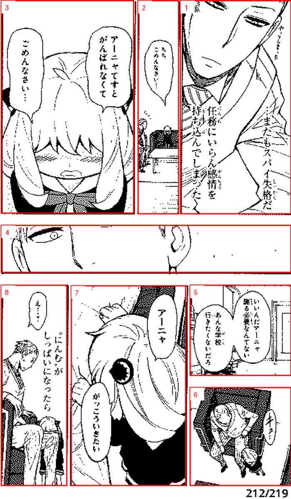
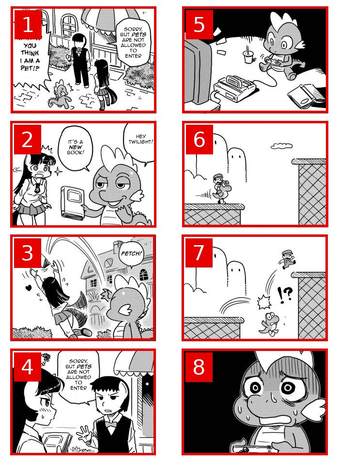
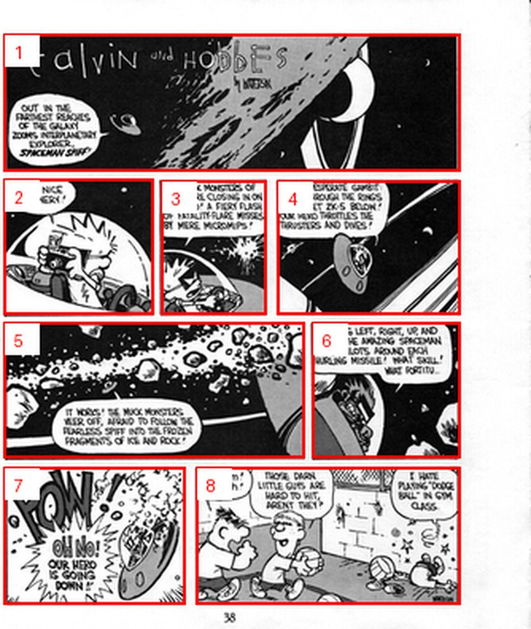
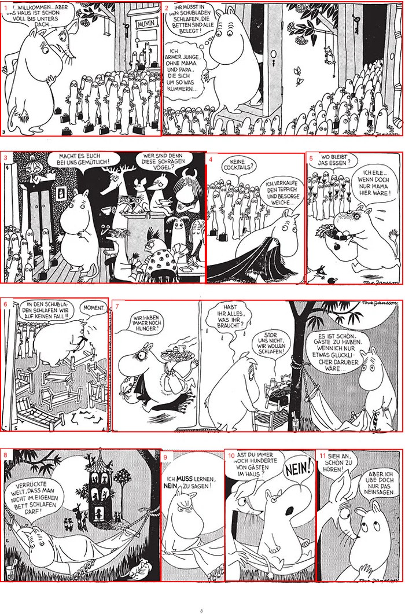
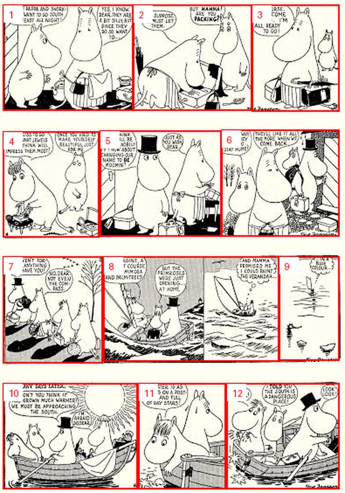
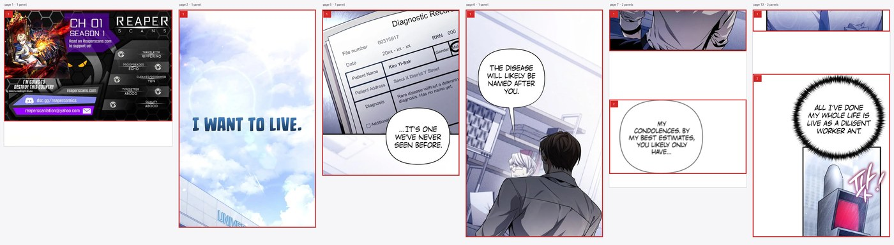

# 🍵 Matcha Reader Tools

Browser-based converters for the [Matcha Reader](https://github.com/eszter007/matcha-reader)
e-reader firmware, a CrossPoint Reader fork with Japanese and Chinese learning features. Everything runs
client-side: **no installs, no uploads**. Files never leave your device, except panel images sent
to Gemini when you supply your own API key, and a book's text when you choose AI furigana or pinyin.

**Four tools:**

| Tool | Input | Output |
|---|---|---|
| 📖 **Manga Converter** | CBZ / ZIP / EPUB / PDF / page images | Manga folder: renamed pages, panel crops, `panels.idx`/`panels.dat` (with OCR text + translations), `meta.bin`, `toc.idx` — and/or a portable `.epub`, `.pdf`, `.xtc` or `.xtch` |
| 📚 **Dictionary Converter** | Chinese: nothing — pick the simplified or traditional edition, built from sources served with the page. Or your own files — Japanese: Yomitan `.zip` (Jitendex, JMnedict, grammar), jmdict-simplified `.json`/`.json.tgz`, MDict `.mdx`. Chinese and Cantonese: CC-CEDICT / CC-Canto text, the MoE `dict-revised.json`, Yomitan, MDict, a `headword<TAB>definition` TSV, with optional frequency, level, example-sentence and jyutping lists | `dict/<name>.idx` + `.dat` + `.spx` for Japanese; `dictionaries/zh/` or `dictionaries/yue/` with `vocab.*`, `names.*` and `.title` files for Chinese |
| 🔤 **Font Converter** | TTF / OTF (up to 4 styles + fallback font) | `.fonts/<Family>/<Family>_<size>.cpfont` (v4, with kerning + ligatures) |
| 🈷 **Furigana & Pinyin** | A Japanese or Chinese EPUB (+ optionally your own CC-CEDICT and a frequency list) | The same EPUB with furigana, or pinyin / zhuyin, as `<ruby>` over the text |

Each tool downloads a zip already laid out for the SD card: unzip it onto the card, or upload the
files via the reader's built-in Wi-Fi web file transfer.

## What the panel detection does

Red boxes are the panels found; numbers are their reading order. Pick the **book type** in step
3 and the rest follows.

<details>
<summary><b>Manga</b> — right to left, then down the page</summary>

A full-width panel separates the rows around it, and a tall panel beside two stacked shorter ones
resolves correctly. The order comes from a topological sort, not from clustering panels by their
vertical centre.


</details>

<details>
<summary><b>4-koma</b> — each column top to bottom, then the next column</summary>

A 4-koma page is two strips side by side, not rows across the page, so it reads down one column
and then down the next; the row-major order would interleave the two gags. It is the same rule
with the axes swapped, so a title page whose left half is one full-height illustration beside a
strip of four still works — the illustration is a column of its own and reads last.

Japanese pages read the right column first. A banner across the top reads before both, being a
tier of its own.


Pick the left-to-right variant for a strip page that reads that way, as this English one does.


</details>

<details>
<summary><b>Western comic</b> — left to right, then down the page</summary>

The same logic mirrored. The paper border and page number are cropped off first, so the scan
fills the screen.


</details>

<details>
<summary><b>Western comic</b> — newspaper strip collections</summary>

Trimming the margin before detection is what makes this page come out as all 11 panels.
Untrimmed it returns 9, with one strip left undivided.


</details>

<details>
<summary><b>Western comic</b> — another strip page</summary>

Twelve panels across four strips, in reading order.


</details>

<details>
<summary><b>Webtoon / manhwa</b> — one long vertical strip</summary>

The fixed-height tiles it ships in are reassembled and re-cut at the artwork's gutters, so no
page starts or ends mid-panel. A 48-tile chapter became 42 pages filling 90% of the screen on
average.


</details>

## Hosting / running

It's a static site with no build step. Any static host works:

- **GitHub Pages**: enable Pages for this repo (Settings → Pages → Source: *GitHub Actions*).
  The included workflow (`.github/workflows/pages.yml`) deploys on every push to `main`.
- **Locally**: `python3 -m http.server` in the repo root, then open `http://localhost:8000`.

The deploy workflow stamps every `css/` and `js/` URL with the commit SHA
(`js/manga-ui.js?v=42dd0bbd`). Pages caches each file for ten minutes, so without this a browser
can pair a fresh page with a stale script. That happened once and killed every control on the
page. Stamping at deploy time means the version cannot be forgotten, and local development keeps
plain paths.

The vendored ONNX Runtime, PDF.js and the YOLO model stay unstamped on purpose: pinned, rarely
changed, and 21 MB for the model alone. Bump their paths if one is replaced.

## Manga converter options

| Control | Desktop flag | Effect |
|---|---|---|
| **Export format** | — | Any combination of Matcha Reader folder, EPUB, PDF, XTC, XTCH. Nothing preselected. Later steps adapt to the pick. |
| **Book type** | `--ltr` `--trim-margins` `--webtoon` | Manga reads right to left. Western comic reads left to right and trims the paper border; the detector is manga-trained, so it misses panels on dense strip layouts and the page warns about it. Webtoon reassembles the strip and re-cuts it at the artwork's gutters, no model involved. Nothing preselected. |
| **Panels only** | *(browser only)* | Ships panel crops without full pages. A page whose panels miss artwork keeps its full page; so does the cover. |
| **Target resolution** | `--x3` `--x4` | Downscales before detection. X4 480×800, X3 528×792, or a custom 1–4096 px size. Never upscales. Full resolution warns: the Xteink firmware struggles with it. |
| **Translate into** | *(browser only)* | Language the translations come back in. The desktop tool always uses English. |
| **Language** (step 5) | `--language` | Splits reading stats by language, and tells OCR what to expect. `jp`→`ja`, `cn`→`zh`, `kr`→`ko`; `zh-Hant` kept intact. |
| **AI panel detection** | — | YOLO26 in-browser. Untick for the white-gutter heuristic, which is also the automatic fallback. Disabled for webtoons, whose panels come from gutters. |
| **Rotate wide panels** | — | EPUB, PDF and XTC/XTCH only: those bake in orientation. The Matcha format rotates on the device instead. |
| **1-bit BMP** | `--mono` | Dithered black-and-white pages. One fast refresh on the device. Best for line art. |
| **Dither brightness** | *(browser only)* | Gamma applied before dithering, for scans that come out darker than the original. Affects 1-bit BMP and XTC/XTCH only. |

**EPUB** is fixed-layout EPUB 3, right-to-left, each page followed by its panels, with the chapter
list carried over. **PDF** holds the same images, one per page, for any PDF viewer. **XTC / XTCH** is Xteink's own format for the stock firmware, 1-bit and 4-level
grayscale; XTCH needs a page height divisible by 8. All are browser-only, as is Panels only.

Panel crops go in a `panels/` subfolder so the device does not walk a crop per panel when opening
the book. The older flat layout still works; re-convert for the faster open.

## Chinese dictionaries

For Chinese the Dictionary page offers two ready-made editions, built from sources served with the
page ([`data/README.md`](data/README.md)), so there is nothing to download first:

| Edition | Equivalent desktop run |
|---|---|
| **Simplified** | CC-CEDICT, `--frequency` jieba `dict.txt`, `--levels hsk30.csv --level-name HSK`, Tatoeba `--examples-script simplified`, `--split-names` |
| **Traditional** | The same with jieba `dict.txt.big`, `--levels tocfl-202307.csv --level-name TOCFL`, `--examples-script traditional` and `--zhuyin` |

Both are byte-identical to `convert_jmdict.py` on the same files, and match the firmware's
`dictionaries-zh` release packs except that the traditional pack also merges the MoE dictionary.
**My own files** opens the full form below. The **Language** choice decides the folder the zip
lays out: `dictionaries/zh/` for Chinese (one folder serves simplified and traditional books
alike, both forms of every word are indexed), `dictionaries/yue/` for Cantonese. Japanese keeps
`dict/`.

| Control | Desktop flag | Effect |
|---|---|---|
| **Dictionary file(s)** | `--input` (repeatable) | CC-CEDICT `.u8`/`.txt`/`.gz`, CC-Canto, `dict-revised.json` (unpack the `.xz` first; the browser has no xz), Yomitan `.zip`, MDict `.mdx`, `.tsv`. Several files merge; a word in two shows both entries, CC-CEDICT first. |
| **Word frequency list** | `--frequency`, `--frequency-kind` | jieba `dict.txt` / `dict.txt.big`, BCC, SUBTLEX, or any one-word-per-row list. Ranks the entries so the common sense shows first and the device's page segmentation prefers common words; a word missing from the list takes its other-script form's rank. |
| **Graded word list** + label | `--levels`, `--level-name` | `hsk30.csv` or `tocfl-202307.csv` from the ivankra repos: each entry gets a `[HSK 3]`-style tag on its grammar line. Variant cells (`你/妳`, `爸爸\|爸`) count for every form. |
| **Example sentences** + script | `--examples`, `--examples-script` | A Tatoeba sentence-pairs export or a `sentence<TAB>translation` file; entries of two or more characters get up to two short examples, in the chosen script only. |
| **Cantonese readings** | `--jyutping` | `cccedict-canto-readings`: jyutping after the pinyin of every CC-CEDICT entry it covers. |
| **Zhuyin** | `--zhuyin` | Bopomofo beside the pinyin. |
| **Proper nouns to names** | `--split-names` | Capitalised CC-CEDICT entries (places, people, dynasties) go to `names.*` and show as Name entries; languages, nationalities, weekdays, months and festivals stay in the vocabulary. |
| **Dictionary name** | `--title` | The footer label, `vocab.title`; default is the sources joined (`CC-CEDICT + MoE`). |

## Furigana & Pinyin

Adds readings above the text of an EPUB, the way the reader shows a book's own ruby, with its
Furigana or Pinyin / Zhuyin toggle to hide them. Existing ruby, scripts, styles and the head are
left alone.

| | Dictionary | AI (Gemini) |
|---|---|---|
| **Chinese** — `tools/pinyin_ruby/add_pinyin_ruby.py` | Longest-match segmentation against CC-CEDICT (a built-in copy, or your own file), one `<rt>` per character, the everyday reading of a word over a surname's. Nothing leaves the device. | `--ai`: Gemini reads each sentence and picks the reading meant there (石 *shí* or *dàn*); a reading is used only when CC-CEDICT lists it for that character. |
| **Japanese** — `tools/furigana_ruby/add_furigana_ruby.py` | Page only (the firmware's tool has none): the built-in IPADIC, via [kuromoji.js](https://github.com/takuyaa/kuromoji.js), splits each sentence into words and gives each its likeliest reading (今日 is always *きょう*). Nothing leaves the device. | Gemini lists each word with its reading; a reading is used only when it is kana and fits the word as written, so okurigana stays bare. |

The AI method sends the book's text to Google, sentence by sentence, under your own key (shared
with the Manga page, kept in `localStorage`). Chinese can also leave the N commonest words of a
frequency list bare, and write zhuyin instead of pinyin. The built-in dictionaries and their
licences are listed in [`data/README.md`](data/README.md).

## Fidelity to the firmware's Python tools

Ports of the firmware's scripts, not reimplementations from the spec.

| Tool | Ports | Output |
|---|---|---|
| Manga | `tools/manga_convert/convert_manga.py` | Byte-identical, given the same input pixels |
| Dictionary | `tools/dict_convert/convert_jmdict.py` (Japanese, Chinese and Cantonese paths), `scripts/gen_dict_spx.py` | Byte-identical |
| Furigana & Pinyin | `tools/furigana_ruby/add_furigana_ruby.py`, `tools/pinyin_ruby/add_pinyin_ruby.py`, `tools/ruby_common/ruby_epub.py` | Identical XHTML for the same model answers; the zip is stored rather than deflated. Japanese dictionary furigana has no Python counterpart |
| Fonts | `lib/EpdFont/scripts/fontconvert_sdcard.py` | Byte-identical except glyph bitmaps |

Three places where pixels differ, each verified within ±2 px: AI detection (same
[YOLO26 model](https://huggingface.co/leoxs22/manga-panel-detector-yolo26n), ONNX Runtime instead
of PyTorch, so float rounding differs), downscaling and PDF rasterization (browser canvas and
PDF.js instead of Pillow and PyMuPDF), and glyph bitmaps (the browser's font engine instead of
FreeType). Post-processing after detection is identical. Everything else is pixel-exact.

`js/mdx.js` additionally ports `readmdict` for MDict input: engine 1.2/2.0, zlib/LZO/uncompressed
blocks, `Encrypted=2` key-index encryption, and `Encrypted=1` registration encryption given the
owner's code and the email it was issued to. Without one it falls back to a key-block scan, which
recovers most such files.

## Tests

The suite generates reference output with the firmware's Python tools and compares bytes. It
needs a checkout of the firmware repo next door, or `MATCHA_READER=/path/to/repo`:

```bash
pip install Pillow freetype-py fonttools    # for reference generation
pip install numpy onnxruntime               # optional: YOLO panel-detection references
pip install pymupdf                          # optional: PDF-input references
pip install readmdict python-lzo             # optional: MDict .mdx references (needs liblzo2-dev)
python3 test/gen_references.py             # build fixtures + Python references

npm install onnxruntime-web                # optional: YOLO detection in the Node tests
node test/node/run.cjs                     # pure-logic byte comparisons (Node ≥ 18)

npm install playwright                     # browser end-to-end (drives the real pages)
python3 /path/to/matcha-reader/lib/EpdFont/scripts/fontconvert_sdcard.py \
  --intervals latin-ext --size 14 --style regular \
  /usr/share/fonts/truetype/dejavu/DejaVuSans.ttf \
  -o test/fixtures/ref_font/DejaVuSans_14.cpfont
node test/browser/e2e.mjs
```

## Notes & limits

- **Gemini OCR** needs your own API key. Rate limits can make long volumes slow, so
  the converter retries with backoff and keeps the screen awake. *Stop* still packages every
  finished page. The key lives in `localStorage` and goes only to Google.
- **Memory**: pages are processed one at a time, but the output zip is assembled in memory. Very
  large volumes may struggle on low-RAM devices.
- Needs `DecompressionStream`: Chrome/Edge ≥ 80, Safari ≥ 16.4, Firefox ≥ 113.

## License

MIT — see [LICENSE](LICENSE).
